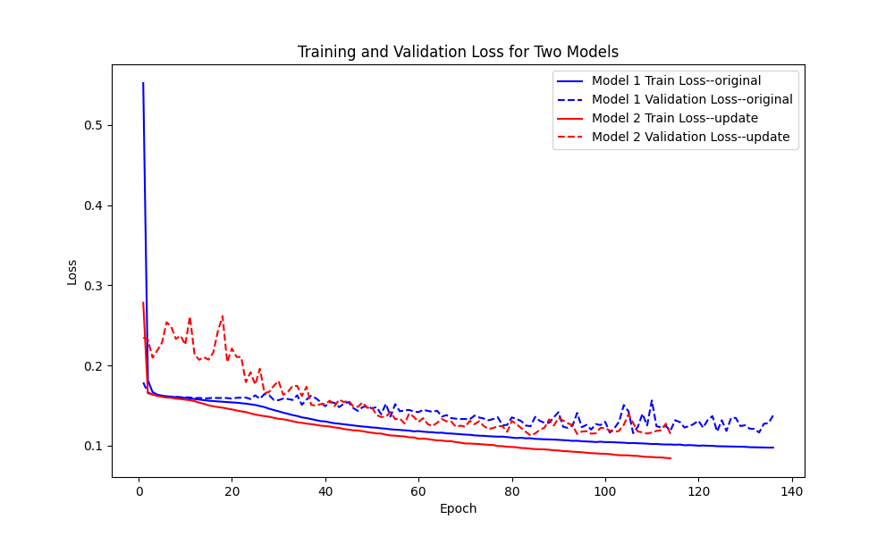

# 四元数域中的高效声音事件定位与检测模型

本项目旨在改进论文 [**Efficient Sound Event Localization and Detection in the Quaternion Domain**](https://arxiv.org/pdf/2204.01851#:~:text=Eleonora%20Grassucci%20,%20Gioia%20Mancini,%20Christian%20Brignone,%20Aurelio) 中提出的模型。原论文提出了利用四元数进行声音事件定位与检测（SELD）的方法。在改进模型的过程中，本项目引入了SE模块、AT模块、多头注意力机制和预激活残差块等技术手段，提升了模型的特征提取能力和整体性能。

## 目录
- [四元数域中的高效声音事件定位与检测模型](#四元数域中的高效声音事件定位与检测模型)
  - [目录](#目录)
  - [项目概述](#项目概述)
  - [原论文简介](#原论文简介)
    - [原始模型的主要特性：](#原始模型的主要特性)
    - [原始论文参考：](#原始论文参考)
  - [模型改进](#模型改进)
    - [1. **SE（Squeeze-and-Excitation）模块**](#1-sesqueeze-and-excitation模块)
    - [2. **AT（Attention）模块**](#2-atattention模块)
    - [3. **多头注意力机制**](#3-多头注意力机制)
    - [4. **预激活残差块**](#4-预激活残差块)
  - [安装](#安装)
  - [数据集](#数据集)
  - [使用方法](#使用方法)
  - [结果展示](#结果展示)
  - [致谢](#致谢)
  - [未来工作](#未来工作)
  - [参考文献](#参考文献)

## 项目概述
本仓库包含复现并改进的基于四元数的声音事件定位与检测（SELD）模型的代码。本项目旨在通过引入先进的深度学习技术，优化原始模型的特征提取与整体性能。

## 原论文简介
原论文提出使用四元数神经网络（QNN）处理声音事件定位与检测任务。四元数域能够紧凑高效地表示多维数据（例如3D声场），并能够同时处理相位和幅度信息。

### 原始模型的主要特性：
- **四元数神经网络（QNN）**：该架构利用四元数更加高效地处理多维声音输入，相比实数值模型更具优势。
- **双四元数卷积层（DualQ-Conv）**：分别处理四元数的实部和虚部，增强了特征提取过程。

### 原始论文参考：
Efficient Sound Event Localization and Detection in the Quaternion Domain. [ArXiv link](https://arxiv.org/pdf/2204.01851#:~:text=Eleonora%20Grassucci%20,%20Gioia%20Mancini,%20Christian%20Brignone,%20Aurelio)

## 模型改进
以下模块被加入到原始架构中以优化其性能：

### 1. **SE（Squeeze-and-Excitation）模块**
SE模块通过显式建模通道间的依赖关系来重新校准通道特征响应。它可以提升所提取特征的质量，聚焦于最有信息量的特征。

### 2. **AT（Attention）模块**
注意力机制帮助模型通过赋予输入不同部分不同的权重来聚焦于重要特征。在实现过程中，我优化了掩码的处理策略，以更好地处理时间序列上的注意力权重。

### 3. **多头注意力机制**
多头注意力机制允许模型同时关注输入特征的不同方面，增强了模型的并行处理能力，从而提高了模型的泛化性能。

### 4. **预激活残差块**
通过将传统的残差块替换为预激活残差块，模型的梯度流动得到了改善，从而有效缓解梯度消失问题，支持更深的网络训练。

## 安装
要运行此项目，您需要安装 Python 3.x 及以下依赖库：
```bash
torch
argparse
pickle
...
```

## 数据集
[L3DAS21 challenge](https://github.com/l3das/L3DAS21)

## 使用方法
```bash
git clone ...
pip install ...
python train.py --TextArgs=config/SERVER_DQSELD-TCN-S1-PHI_8ch.txt

修改 config 数据集以及文件保存路径
```

## 结果展示
下图展示了原始模型与改进模型的训练损失和验证损失对比：

从图中可以看出，两个模型的训练和验证损失随着epoch增加而下降。红色线条代表更新后的模型，蓝色线条代表原始模型。更新后的模型（Model 2）的训练损失和验证损失都明显比原始模型（Model 1）低，表明改进后的模型在训练集和验证集上的表现更加优越。
- 训练损失：更新后的模型（红色实线）收敛得更快，且最终损失更低。
- 验证损失：更新后的模型（红色虚线）在大部分epoch中保持较低的波动，并且整体比原始模型的验证损失（蓝色虚线）低。

这些结果表明改进对模型的优化效果显著，有助于提升其特征提取和整体性能。

## 致谢
特别感谢论文的作者们提供的开源代码 [DualQSELD-TCN](https://github.com/ispamm/DualQSELD-TCN)，该项目为我提供了复现与改进的基础框架。同时，也感谢开源社区的支持和帮助，为模型优化提供了宝贵的资源。

## 未来工作
尽管改进效果显著，但仍需进行进一步的测试，并通过更多的评估指标（如准确率、精确率、召回率、F1分数）量化这些改进的影响。

## 参考文献
- Efficient Sound Event Localization and Detection in the Quaternion Domain. [ArXiv link](https://arxiv.org/abs/2205.04435)
- Squeeze-and-Excitation Networks. [ArXiv link](https://arxiv.org/abs/1709.01507)
- Attention Is All You Need. [ArXiv link](https://arxiv.org/abs/1706.03762)
- Deep Residual Learning for Image Recognition. [ArXiv link](https://arxiv.org/abs/1512.03385)

